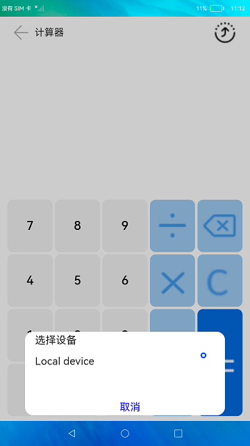

# 分布式计算器

### 介绍

本示例使用分布式能力实现了一个简单的计算器应用，可以进行简单的数值计算，支持远程拉起另一个设备的计算器应用，两个计算器应用进行协同计算。

远程拉起：通过StartAbility实现远端应用的拉起。

协同计算：通过DistributedDataKit分布式数据框架实现异端应用的数据同步。

本示例用到了媒体查询接口[@ohos.mediaquery](https://gitee.com/openharmony/docs/blob/master/zh-cn/application-dev/reference/apis-arkui/js-apis-mediaquery.md)。

分布式设备管理能力接口(设备管理)，实现设备之间的kvStore对象的数据传输交互[@ohos.distributedDeviceManager](https://gitee.com/openharmony/docs/blob/master/zh-cn/application-dev/reference/apis-distributedservice-kit/js-apis-distributedDeviceManager.md)。

分布式数据管理接口[@ohos.data.distributedData](https://gitee.com/openharmony/docs/blob/master/zh-cn/application-dev/reference/apis-arkdata/js-apis-distributed-data.md)。

### 效果预览
| 首页                                  |
|-------------------------------------|
|  |

使用说明

1.点击桌面应用图标，启动应用。

2.点击应用右上角按钮，或者在界面任意位置滑动（上下左右滑动皆可）即可弹出设备选择框。

3.在设备选择框中点击对端设备名称，拉起对端应用。

4.对端应用启动后，可在任意一端中操作应用，两端应用可实现数据实时同步。

5.在设备选择框中选中本机即可关闭对端应用。

#### 相关概念

数据管理实例： 用于获取KVStore的相关信息。

单版本分布式数据库：继承自KVStore，不对数据所属设备进行区分，提供查询数据和同步数据的方法。

### 工程目录
```
entry/src/main/ets/
|---pages
|   |---index.css                           // 首页样式
|   |---index.hml                           // 首页结构
|   |---index.js                            // 首页逻辑
|---common                                    
|   |---Calculator.js                       // 计算器模块
|   |---KvStoreModel.js                     // kvstore对象操作类
|   |---RemoteDeviceModel.js                // 远程设备操作类                                                     
```

### 具体实现
在分布式计算器应用中，分布式设备管理包含了分布式设备搜索、分布式设备列表弹窗、远端设备拉起三部分。  
首先在分布式组网内搜索设备，然后把设备展示到分布式设备列表弹窗中，最后根据用户的选择拉起远端设备。
#### 分布式设备搜索
通过SUBSCRIBE_ID搜索分布式组网内的远端设备，详见startDeviceDiscovery(){}模块
#### 分布式设备列表弹窗
使用calc-select-device-dialog渲染分布式设备列表弹窗
#### 远端设备拉起
selectDevice()发起远程设备调用，featureAbility.startAbility()方法拉起远端设备的包，调用dataChange(key, value)改变kvstore的值。
#### 分布式数据管理
(1) 管理分布式数据库  
创建一个KVManager对象实例，用于管理分布式数据库对象。通过distributedData.createKVManager(config)，并通过指定Options和storeId，创建并获取KVStore数据库，并通过Promise方式返回，此方法为异步方法，例如this.kvManager.getKVStore(STORE_ID, options).then((store) => {})，[源码参考](entry/src/main/js/MainAbility/common/kvstoreModel.js )。  
(2) 订阅分布式数据变化  
通过订阅分布式数据库所有（本地及远端）数据变化实现数据协同，[源码参考](entry/src/main/js/MainAbility/common/kvstoreModel.js )。

#### 分布式计算器模块
1、计算器监听变化数据：onShow() 中监听表达式变化，如果变化就更新kvstore的值，并且featureAbility.getWant((error, want)获取接收到的其他设备的指令，重新渲染数据。
2、计算逻辑：
* 当用户点击C按钮，表达式和运算结果归0。 将this.expression = ''; this.result = '';
* 当用户点击“X”按钮后，删除运算表达式的最后一个字符。
* 当用户点击“=”按钮后，将调用calc(this.expression)对表达式进行数据计算。


### 相关权限

允许不同设备间的数据交换：[ohos.permission.DISTRIBUTED_DATASYNC](https://gitee.com/openharmony/docs/blob/master/zh-cn/application-dev/security/AccessToken/permissions-for-all.md#ohospermissiondistributed_datasync)

允许系统应用获取分布式设备的认证组网能力：[ohos.permission.ACCESS_SERVICE_DM](https://gitee.com/openharmony/docs/blob/master/zh-cn/application-dev/security/AccessToken/permissions-for-system-apps.md#ohospermissionaccess_service_dm)

### 依赖

不涉及

### 约束与限制

1.本示例只实现简单的加减乘除功能，后续开发者可基于当前框架考虑在calc页面中实现更多的功能，如开方、立方、三角函数等科学计算功能。

2.分布式计算功能使用的前提是分布式组网。

3.本示例需要使用DevEco Studio 3.0 Beta4 (Build Version: 3.0.0.992, built on July 14, 2022)才可编译运行。

4.本示例需要使用@ohos.distributedDeviceManager系统权限的系统接口。使用Full SDK时需要手动从镜像站点获取，并在DevEco Studio中替换，具体操作可参考[替换指南](https://gitee.com/openharmony/docs/blob/master/zh-cn/application-dev/faqs/full-sdk-switch-guide.md)。

5.如果安装本示例报错为error：install sign info inconsistent，则有可能本应用被设置为系统预置应用，已安装在系统中，此时需使用命令进行替换安装，并在替换安装后对设备进行重启操作，具体命令如下：

hdc shell mount -o rw,remount /

hdc file send ./entry-default-signed.hap /system/app/com.example.distributedcalc/Calc_Demo.hap

hdc shell  reboot

等设备重启后即可完成应用的替换安装，无需其他操作。

### 下载

如需单独下载本工程，执行如下命令：
```
git init
git config core.sparsecheckout true
echo code/SuperFeature/DistributedAppDev/DistributedCalc/ > .git/info/sparse-checkout
git remote add origin https://gitee.com/openharmony/applications_app_samples.git
git pull origin master
```